# Azure DevOps Timesheet (Chrome Extension)

Extensão (Manifest V3) para **automatizar e facilitar o lançamento de horas** no Azure DevOps, adicionando widgets e automações diretamente nas páginas do `dev.azure.com`.

## Onde funciona

- **Domínio**: `https://dev.azure.com/*`
- **Tipo**: content script (executa no contexto da página)

## Instalação (modo usuário)

Este modo é para quem **só quer usar** a extensão sem clonar o repositório.

1. Baixe o arquivo [`chrome-ado-hours-1.0.0.zip`](https://github.com/orangedoorit/azure-lancamento-horas-chrome-extension/releases/download/v1.0.0/chrome-ado-hours-1.0.0.zip)
2. Extraia o ZIP em uma pasta (ex.: `chrome-ado-hours/`). O conteúdo fica **na raiz** dessa pasta (`manifest.json`, `content.js`, etc.); **não** há uma subpasta `dist/` dentro do arquivo.
3. No Chrome, abra `chrome://extensions`
4. Ative **Developer mode**
5. Clique em **Load unpacked** e selecione a pasta extraída (ela deve conter `manifest.json` e `content.js`)
6. Acesse o [Azure DevOps da OrangeDoor](https://dev.azure.com/orangedoorit/OrangeDoor%20Global%20Projects) e recarregue a página


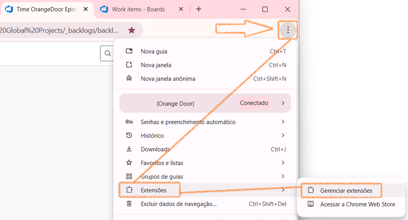

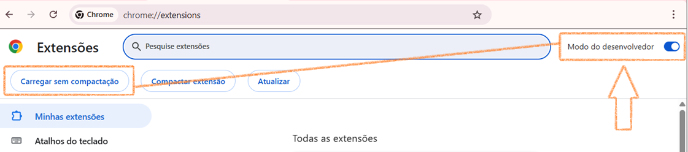

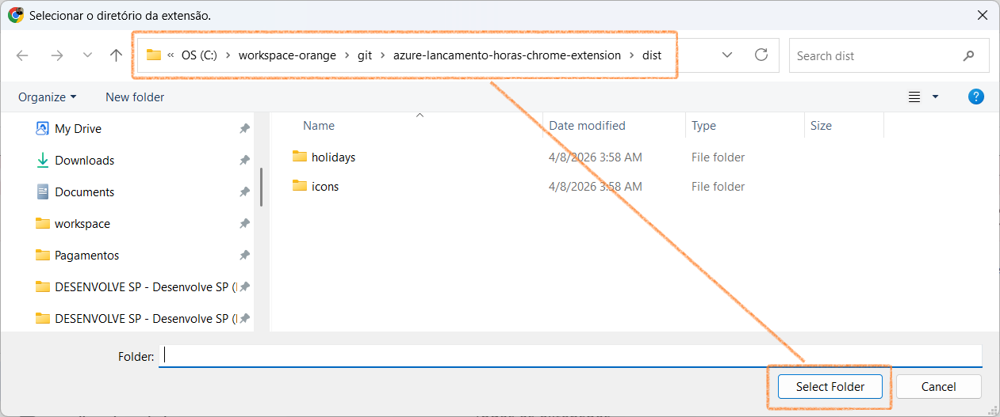

## Instalação (modo desenvolvedor)

1. Rode o build:

```bash
npm install
npm run build
```

2. No Chrome, abra `chrome://extensions`
3. Ative **Developer mode**
4. Clique em **Load unpacked** e selecione a pasta `dist/`
5. Acesse o Azure DevOps (ex.: `https://dev.azure.com/<org>/<project>`) e recarregue a página


## Funcionalidades

### 1) Overlay semanal de horas (Weekly Hours)

Cria um botão flutuante 🕒 no canto inferior direito e abre um modal para visualizar/editar horas por período.

- **Abrir/fechar**: tecla **F2** ou clique no botão 🕒
- **Recursos**:
  - Alternância de visualização (semana / mês / intervalo “range”)
  - Opções de exibição (ex.: finais de semana, agrupamento por hierarquia, colunas de data)
  - Modo edição com salvamento e validações
  - Considera feriados nacionais BR (2026–2030) embutidos no build
- **Toggles úteis (casos comuns)**:
  - **Mostrar LH/Ações**: habilite quando precisar identificar “ações”/atalhos de lançamento e conferir rapidamente **se você lançou no dia errado** (ex.: está lançando hoje as horas de ontem).
  - **Mostrar fim de semana**: habilite quando existirem horas em **sábado/domingo** e elas não estiverem aparecendo na visualização atual.

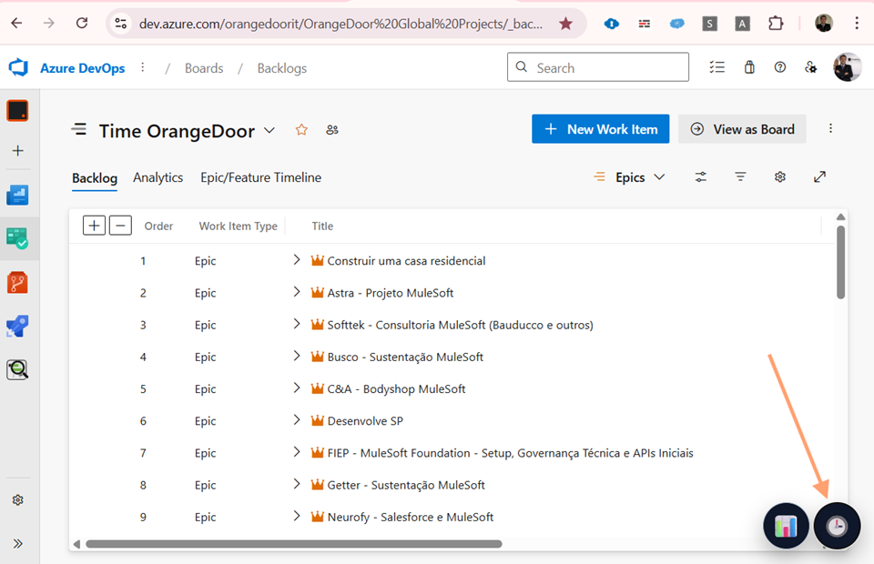

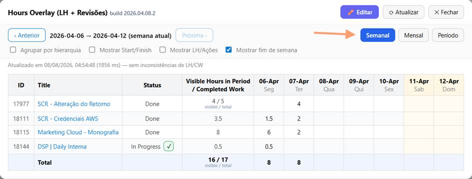

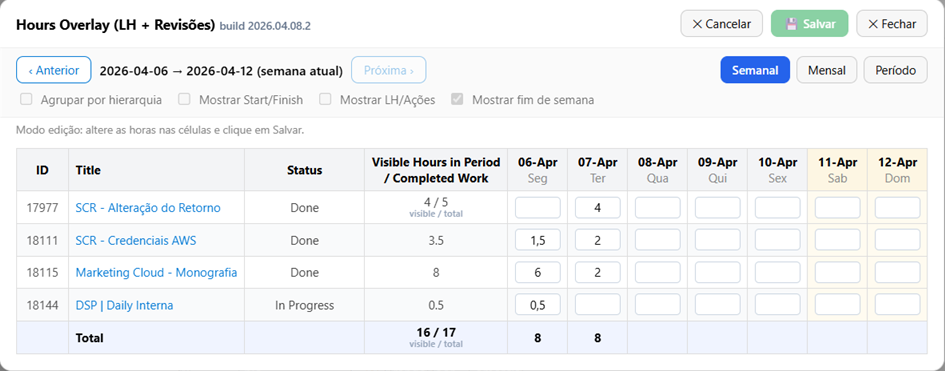

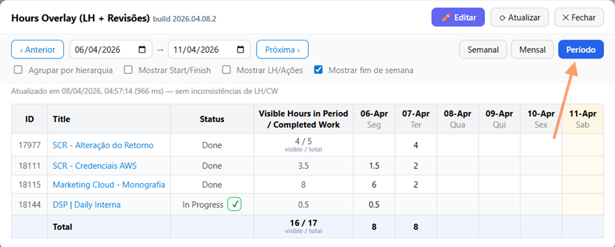

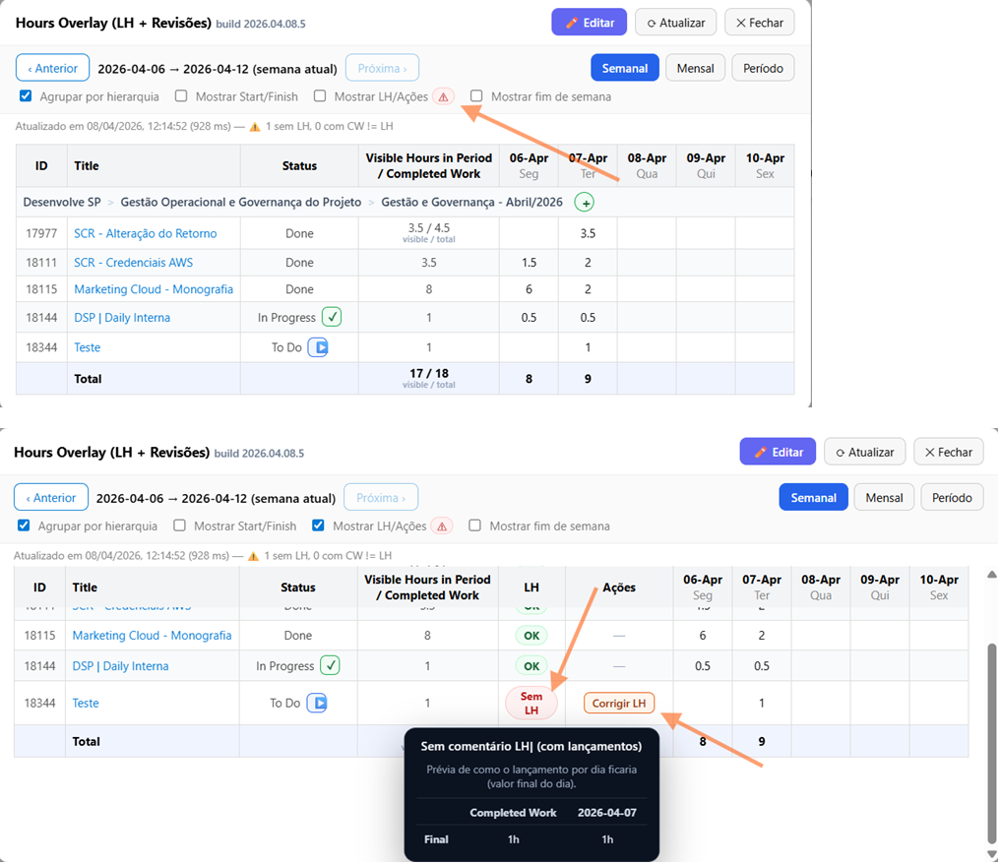

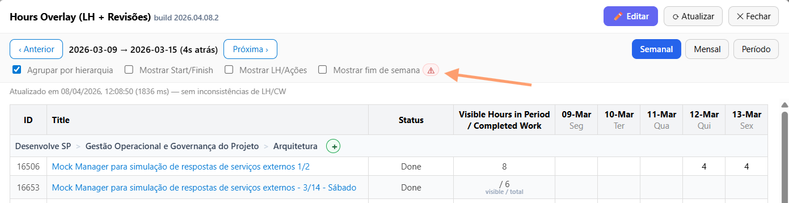

### 2) Relatório mensal por hierarquia (Monthly Hierarchy)

Cria um botão flutuante 📊 e abre um modal com uma tabela consolidada por hierarquia no mês.

- **Abrir/fechar**: tecla **F3** ou clique no botão 📊
- **Recursos**:
  - Navegação de meses
  - Opção de exibir/ocultar finais de semana
  - Botão para **copiar a imagem** da tabela para a área de transferência

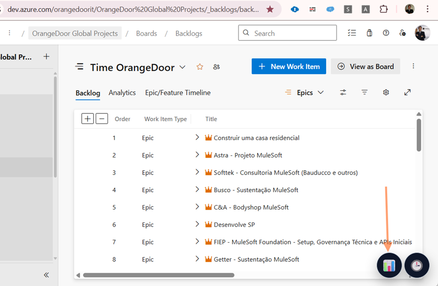

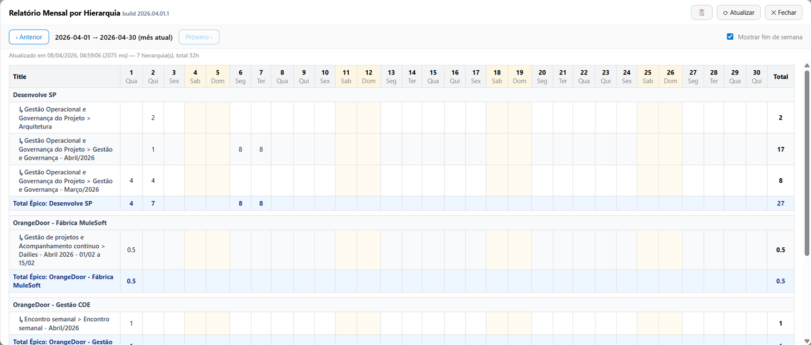

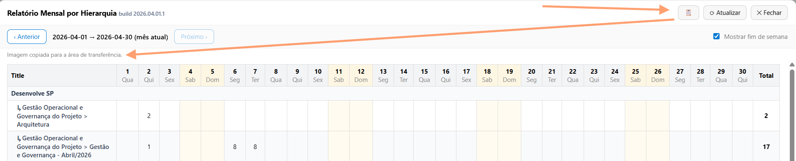

### 3) Enhancer de criação/edição de task (Create Task Enhancer)

Na tela de criar task (e também em edição de work item), adiciona uma UI inline para agilizar preenchimentos e aplicar ajustes automaticamente após salvar.

- **Onde aparece**: páginas `_workitems/create/task` e `_workitems/edit/<id>`
- **O que faz (alto nível)**:
  - Mantém um estado “desejado” (ex.: State, Priority, datas e horas)
  - Captura o “save” (inclusive via **Ctrl+S**) e aplica pós-save via API do ADO quando necessário

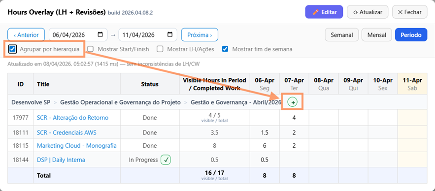

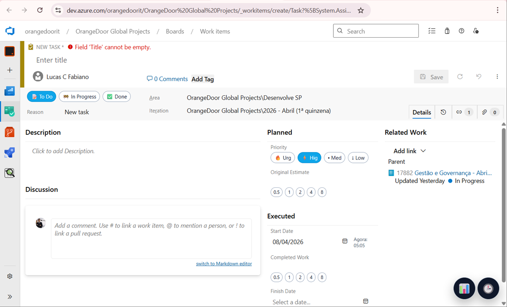

## Teclas de atalho

### Globais (na página do Azure DevOps)

- **F2**: abre/fecha o **Overlay semanal (🕒)**
- **F3**: abre/fecha o **Relatório mensal (📊)**

### Dentro do modal do Overlay semanal (🕒)

- **E**: entrar em modo edição (quando não estiver digitando em um campo)
- **Ctrl+S / Cmd+S**: salvar (apenas em modo edição)
- **Esc**: cancelar edição (apenas em modo edição)
- **← / →**: navegar períodos (quando não estiver em modo edição)
- **Enter**: aplicar intervalo no modo “range” (nos inputs de início/fim)

### Dentro do modal do Relatório mensal (📊)

- **← / →**: navegar entre meses (quando o modal estiver aberto)

## Dados e permissões

- **Permissões**: `storage` (para persistir preferências/estado)
- **Feriados BR**: `public/holidays/br-national-2026-2030.json` é embutido no bundle durante o build

## Desenvolvimento

- **Build**: `npm run build` (gera `dist/`)
- **ZIP para distribuir**: `npm run zip` (gera `dist/chrome-ado-hours-<versao>.zip` com os artefatos **na raiz** do ZIP, pronto para extrair e carregar no Chrome)
- **Watch**: `npm run dev` (build em modo `--watch`)
- **Typecheck**: `npm run typecheck`

## Troubleshooting

- **Não apareceu o botão 🕒/📊**:
  - Confirme que você está em `dev.azure.com` (org/projeto)
  - Recarregue a página do ADO (F5)
  - Em `chrome://extensions`, clique em **Reload** na extensão
  - Confira se você carregou a pasta `dist/` (não `public/`)
  - Ao invés de fazer reload na página, clique no link da página e aperte `Enter`

